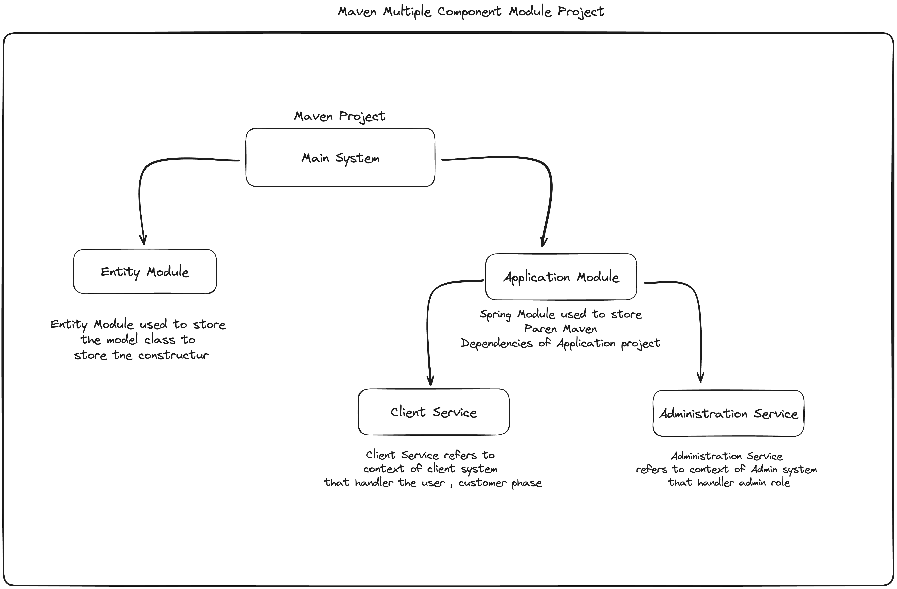

# Dentist Appointment

## Background

This application was developed to address the challenges faced by hospitals or clinics with weak online appointment services. Many healthcare facilities struggle to efficiently manage appointments, leading to inconvenience for both clients and staff. The Dentist Appointment application aims to streamline the appointment booking process, providing a user-friendly platform for clients to schedule appointments with dentists at their preferred date and time.

## Architecture

We have structured the Dentist Appointment application into subsystems to improve maintainability, scalability, and code organization. The architecture follows a multi-module Maven project setup:

- **Dentist-Appointment (Maven)**
    - **DAA-Entities**: This submodule stores the entities layer, managing model classes and dependencies such as JPA Data. It encapsulates the data model of the application.
    - **DAA-Parent**: The parent submodule handles the dependencies required for the application service, including Spring Web, Lombok, etc. It serves as the central module for managing shared dependencies across the application.
        - **DAA-Client**: Within the parent submodule, the client submodule manages the business logic layer of the client phase, following the MVC (Model-View-Controller) pattern. It handles client-side interactions, such as appointment booking and scheduling.

This modular approach allows for better code organization, promotes reusability of components, and facilitates collaboration among developers working on different aspects of the application. Each submodule has a specific responsibility, contributing to the overall functionality of the Dentist Appointment application.

## Why We Choose This Architecture

### Benefits of Subsystem Architecture

- **Modularity**: Subsystems allow for the division of the application into smaller, more manageable units, enhancing maintainability and scalability.

- **Separation of Concerns**: By separating components based on their responsibilities, the architecture promotes code readability and simplifies development and maintenance.

- **Reusability**: Subsystems encapsulate related functionality, promoting code reuse and facilitating collaboration among developers.

- **Scalability**: The modular structure enables easy scalability of the application, allowing for the addition of new features and functionalities without significant changes to the existing codebase.

- **Encapsulation**: Subsystems encapsulate implementation details, hiding complexity and reducing dependencies between different parts of the application.

## License

This project is licensed under the MIT License.
